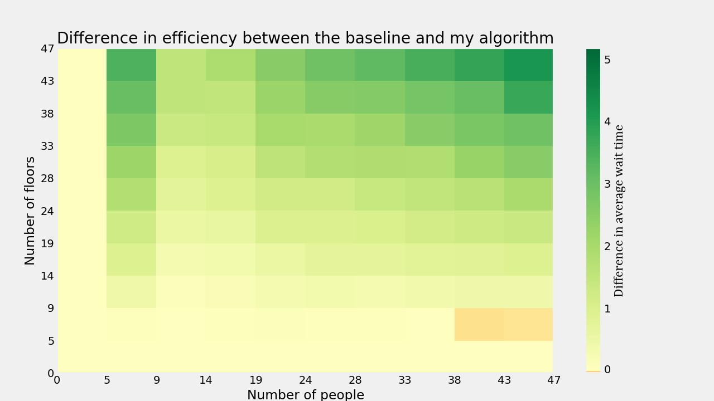

# Elevator algorithms
In this project I am simulating elevator algorithms in Python.
Animation is handled by Tkinter, and plotting is done through MatPlotLib.
## Dependancies
To run this simulation engine, you need to install `tkinter` and `matplotlib` using the `pip` command in terminal.

## Algorithms
There are three supported algorithms:
- `baseline` - this is the mechanical control model from old fashion lifts
- `inefficient` - this is a less efficient solution than the baseline in most cases (see heatmaps)
- `efficient` - this algorithm is equal or more efficient than the baseline algorithm in all cases
<br>The algorithms are called in the code by their string name as listed above

## Examples
These are a few examples of code to run in `elevator.py`:
<br>
This line will run and animate a single simulation showing the efficient algorithm on a system with 10 floors where 30 people are generated at the beginning of the simulation
```
single_simulation(algorithm="efficient", number_of_people=30, number_of_floors=10)
```
Example output: 

<br><br>
This line will run simulations with the efficient algorithm on every combination of floors and people up to 100x100, and graph the results in a heatmap
```
heatmap("efficient", 100, 100)
```
Example output: 

<br><br>
This line will run simulations with the baseline and efficient algorithm on all combinations of floors and people up to 100x100, and graph the difference in their average wait times for each combination in the form of a heatmap where green represents the efficient algorithm being more efficient than the baseline.
```
heatmap_comparison_multicored(max_people=47, max_floors=47)
```
Example output: 
