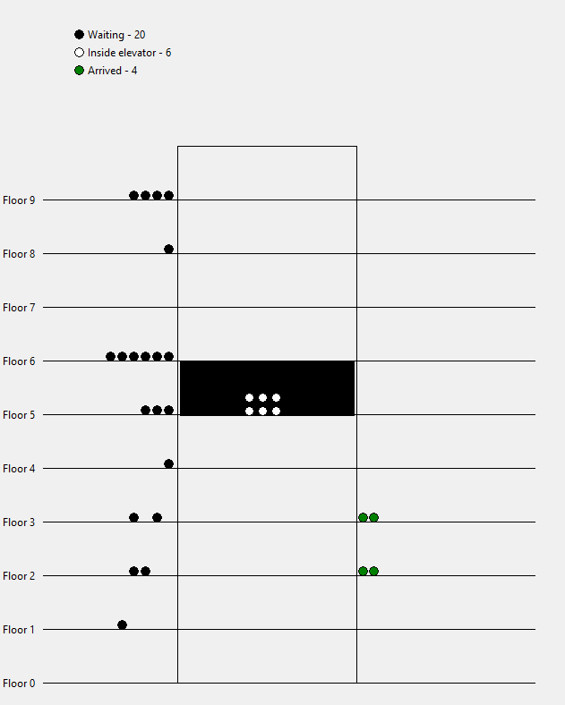
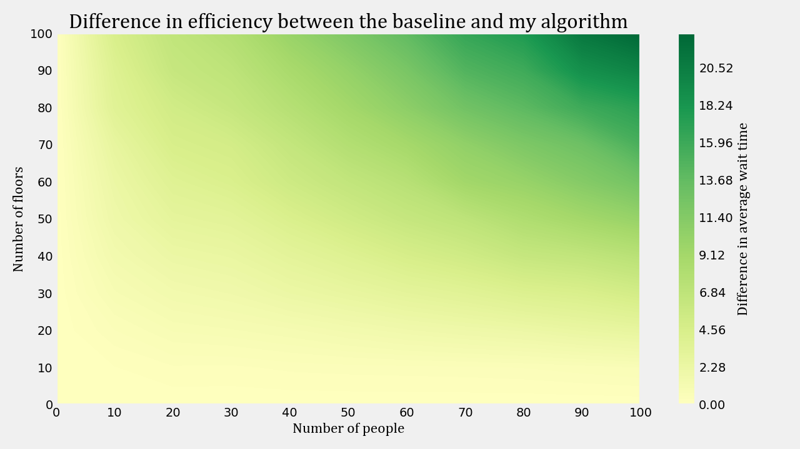
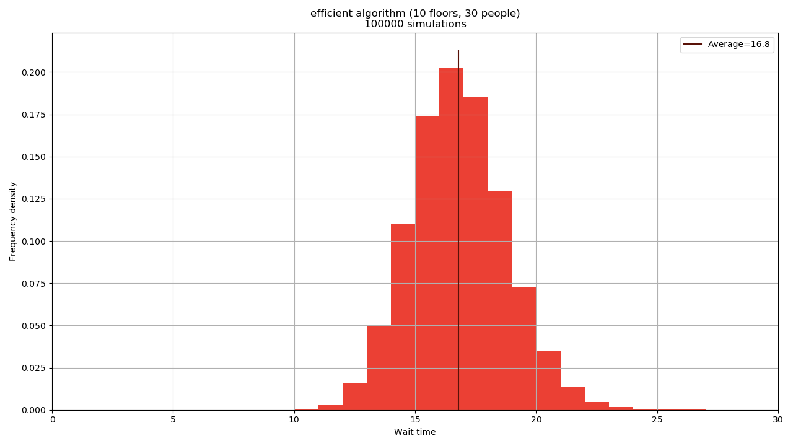
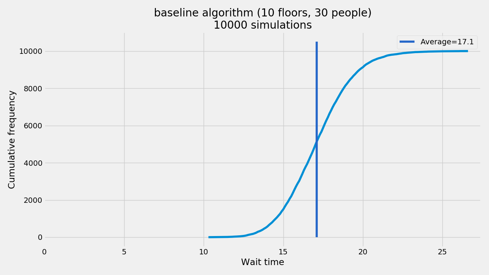
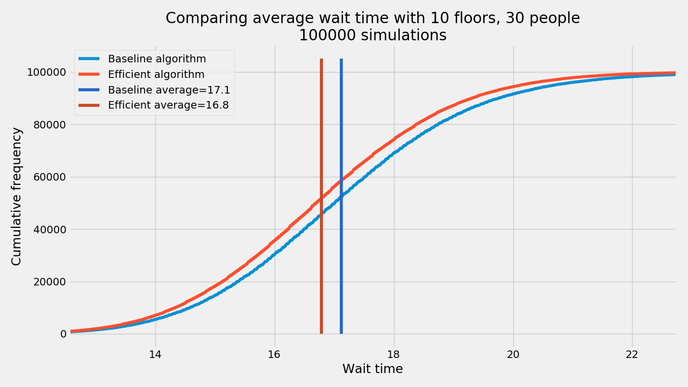
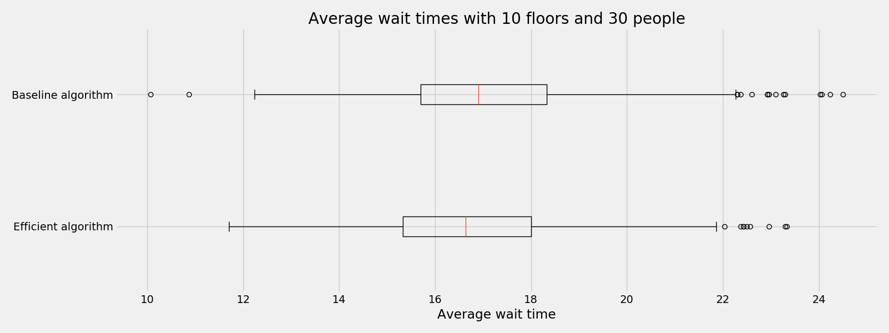

# Elevator algorithms
In this project I am simulating elevator algorithms in Python.
Animation is handled by Tkinter, and plotting is done through MatPlotLib.
## Dependancies
To run this simulation engine, you need to install `tkinter` and `matplotlib` using the `pip` command in terminal.

## Algorithms
There are three supported algorithms:
- `baseline` - this is the mechanical control model from old fashion lifts
- `inefficient` - this is a less efficient solution than the baseline in most cases (see heatmaps)
- `efficient` - this algorithm is equal or more efficient than the baseline algorithm in all cases

The algorithms are called in the code by their string name as listed above

## How to use this code base
These are a few examples of code to run in `elevator.py`:

 ### Individual simulations to run
This line will run and animate a single simulation showing the efficient algorithm on a system with 10 floors where 30 people are generated at the beginning of the simulation
```
single_simulation(algorithm="efficient", number_of_people=30, number_of_floors=10)
```
Example output: 


 ### Heatmaps to graph

This line will run simulations with the efficient algorithm on every combination of floors and people up to 100x100, and graph the results in a heatmap
```
heatmap("baseline", 100, 100)
```
Example output: 

<br><br>
This line will run simulations with the baseline and efficient algorithm on all combinations of floors and people up to 100x100, and graph the difference in their average wait times for each combination in the form of a heatmap where green represents the efficient algorithm being more efficient than the baseline.
```
heatmap_comparison(max_people=47, max_floors=47)
```
Example output: 


To smooth out the heatmap, you can use this line to interpolate the data. You can also use this function to draw a graph for data saved from previous calculations using `heatmap_comparison()`.
```
interpolate_heatmap(*heatmap_comparison(max_people=100, max_floors=100))
```

 ### Frequency graphs

This line will draw a histogram plot of the frequency of wait times for an algorithm. This is to see the distribution of wait times, and show the average.
```
graph_single_algorithm_histogram("efficient", people=30, floors=10, iterations=100_000)
```


This line will draw an frequency of the wait times after a specified number of iterations of a single algorithm
```
graph_one_algorithm_frequency_curve("baseline", 30, 10, 10_000)
```



This line will draw two frequency of the wait times comparing the baseline to my efficient algorithm, as well as their averages.
```
graph_both_algorithms_frequency_curve(30, 10, 100_000)
```
Example output:


This line will draw two box plots to show a comparison between the baseline and my efficient algorithm. This is useful to see the difference in variance and the means.
```
boxplot_comparison(30, 10, 1_000)
```
Example output:
